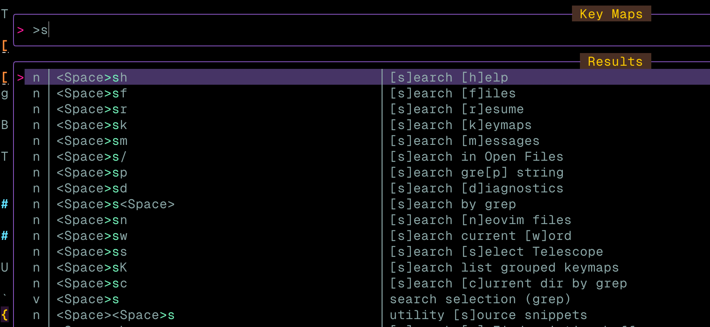

# telescope_grouped_keymaps

The missing newbie plugin "bridge"?

[Which-key](https://github.com/folke/which-key.nvim) lets you group keybinds.

[Telescope.builtin.keymaps](https://github.com/nvim-telescope/telescope.nvim/blob/b4da76be54691e854d3e0e02c36b0245f945c2c7/lua/telescope/builtin/init.lua#L386) is great for searching up keybinds.

But `Telescope.builtin.keybinds` doesn't know about your groupings via `Which-key`!

This plugin tries to bridge that gap with a custom telescope picker (copied & modified from the original keymaps picker). Now you can get the "full description" of your groups description + keys description.



## Getting started

### Usage

let's say you have a which-key group for searching, with a description `[s]earch`:

```lua
--... which-key config ...
local wk = require("which-key")
wk.setup()
wk.add({
  { "<leader>s",        group = "[s]earch" },
})
-- ...
```

And then you add some other keybind, for example some telescope search keybinds:

```lua
--...other config...
local builtin = require("telescope.builtin")
vim.keymap.set("n", "<leader>sh", builtin.help_tags, { desc = "[h]elp" })
vim.keymap.set("n", "<leader>sk", builtin.keymaps, { desc = "[k]eymaps" })
vim.keymap.set("n", "<leader>sf", builtin.find_files, { desc = "[f]iles" })
vim.keymap.set("n", "<leader>ss", builtin.builtin, { desc = "[s]elect Telescope" })
vim.keymap.set("n", "<leader>sw", builtin.grep_string, { desc = "current [w]ord" })
--...
```

You should then get output like in the screenshot above, concatenating your group and keybind descriptions. This lets you keep your descriptions short.

### Installation

Using [Lazy.nvim](https://github.com/folke/lazy.nvim)

```lua
{
	"JulianNymark/telescope_grouped_keymaps.nvim",
	dependencies = {
		"nvim-telescope/telescope.nvim",
		"folke/which-key.nvim",
	},
	opts = {},
	config = function(_, opts)
		local module = require("telescope_grouped_keymaps")
		module.setup({})

		vim.keymap.set("n", "<leader>sK", function()
			module.picker_grouped_keymaps({})
		end, { desc = "list grouped keymaps" })
	end,
},
```
